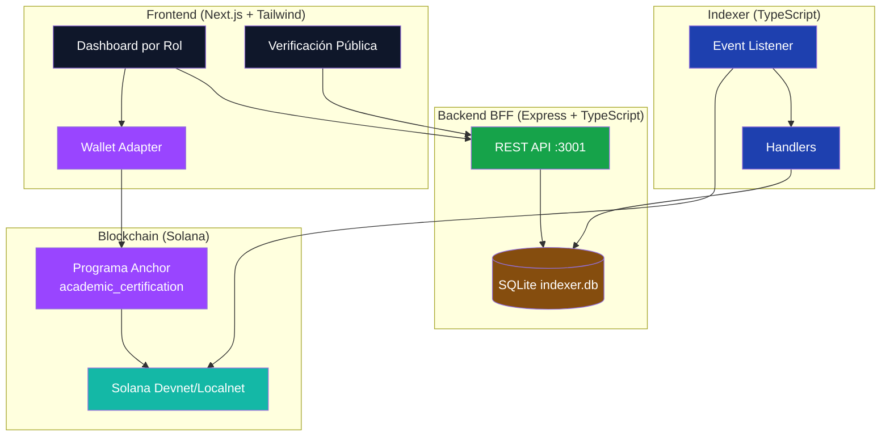
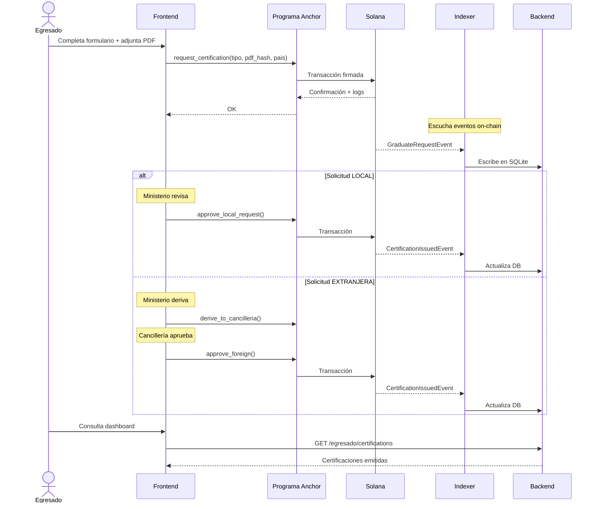
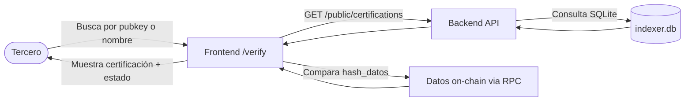
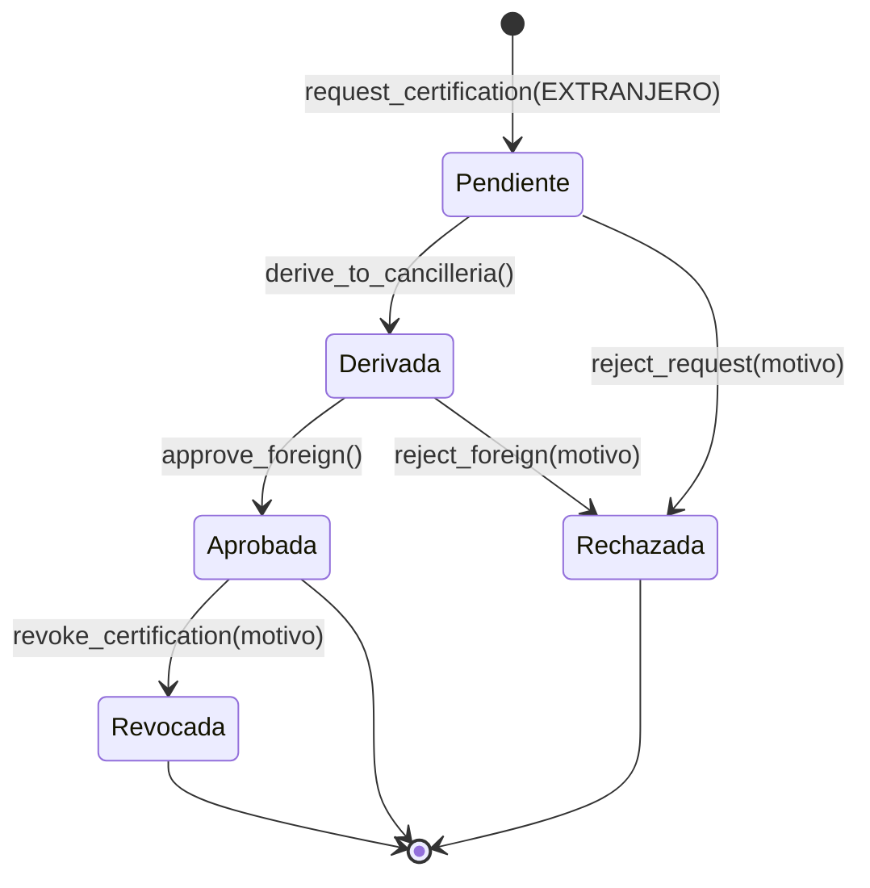

# Diagramas Tecnicos

Este documento reúne los diagramas técnicos del sistema en formato Mermaid (renderizables en GitHub) junto con las imágenes de referencia. Cada sección resume una parte clave de la arquitectura.

## 1. Arquitectura del sistema

## 2. Flujo de datos principal — Solicitud de certificación

## 3. Verificación pública

## 4. Flujo de certificación extranjera

