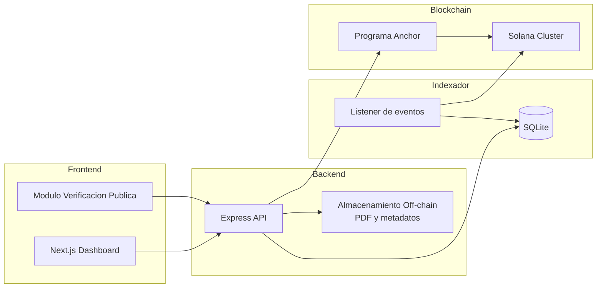
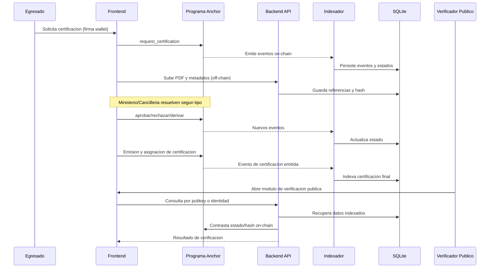

# Diagramas Tecnicos

## Diagrama de Arquitectura (Mermaid)

## Flujo de Datos (Solicitud y Emision)

## Exportables de Entrega
- PENDIENTE: Exportar este contenido a `docs/arquitectura.png`.
- PENDIENTE: Exportar este contenido a `docs/diagrama-flujo.png`.
