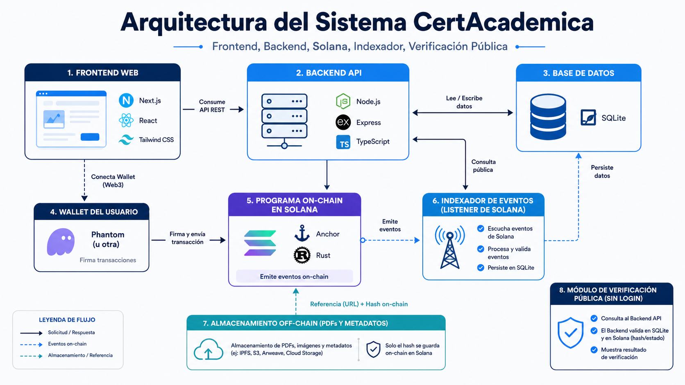
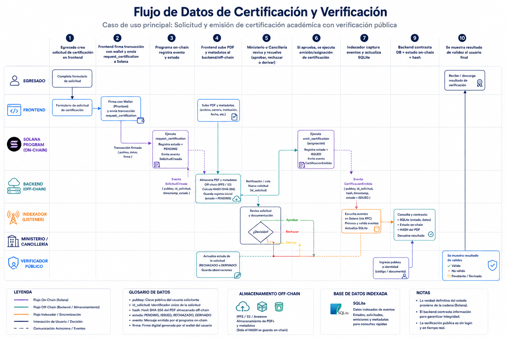

# Diagramas Tecnicos

Este documento reúne las imágenes finales incluidas en la entrega. Cada una resume una parte clave del sistema.

## 1. Arquitectura del sistema

Este diagrama muestra la arquitectura general de la plataforma y cómo se conectan el frontend, el backend, el indexador, la base de datos y la capa on-chain de Solana. Sirve para entender el reparto de responsabilidades entre componentes.

## 2. Flujo de datos principal

Este diagrama resume el recorrido de una solicitud de certificación desde el egresado hasta la emisión y verificación final. Es útil para explicar el proceso extremo a extremo y el rol de cada actor.

## 3. Verificación pública

Este diagrama describe cómo un tercero puede verificar un certificado sin wallet, usando la consulta pública y la validación contra los datos indexados y el estado on-chain.

## 4. Certificación extranjera

Este diagrama muestra el recorrido específico de las solicitudes de títulos extranjeros, incluyendo la intervención del Ministerio y la Cancillería según corresponda.