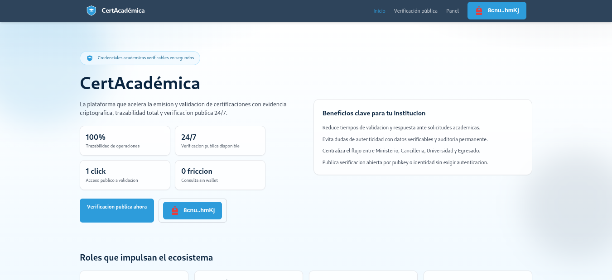
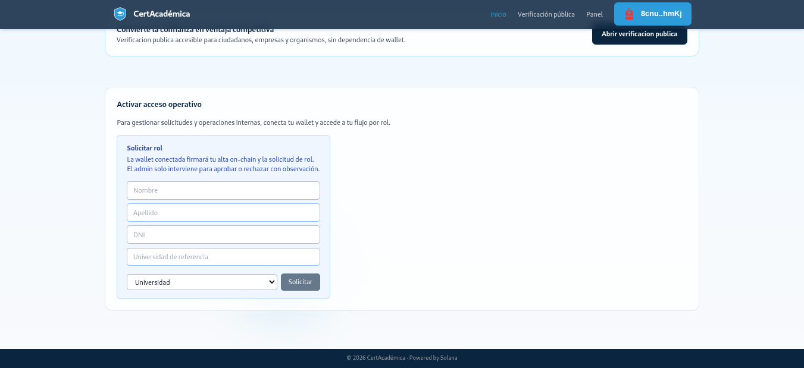
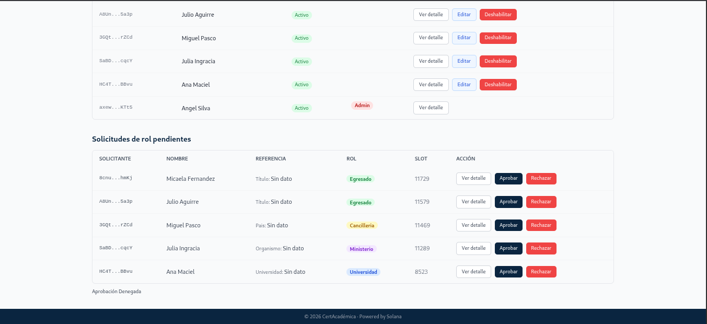
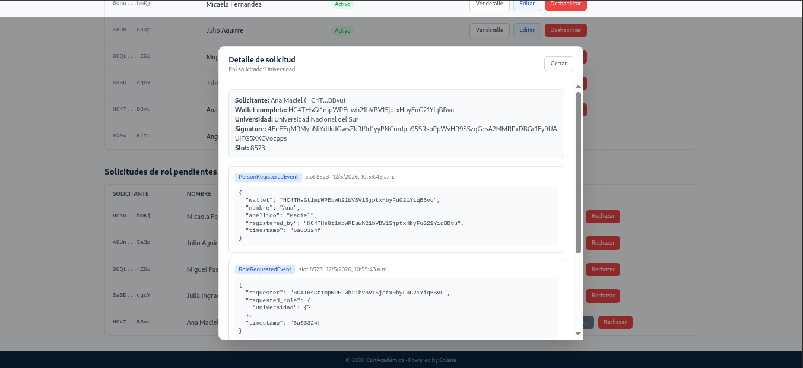
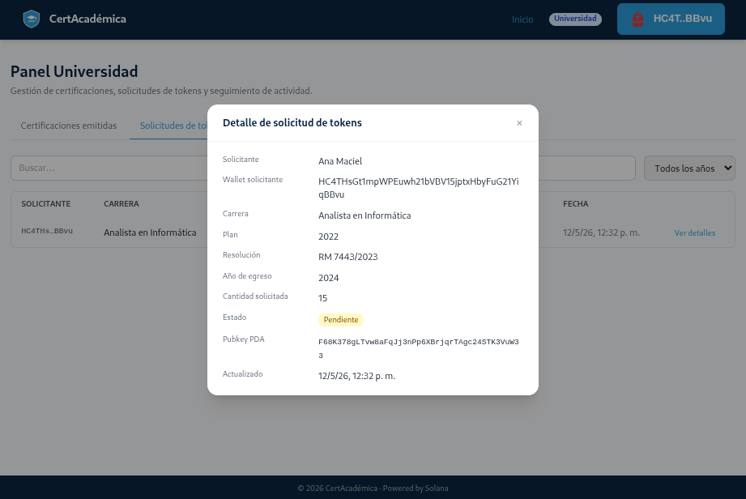
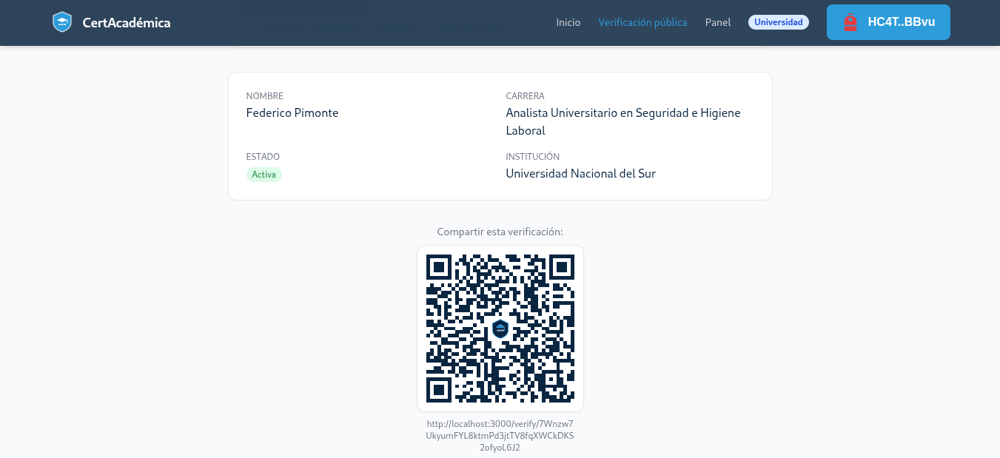

# Capturas de Pantalla - Entrega TFM

Este directorio contiene capturas reales del sistema, organizadas por flujo funcional.

## Galeria de capturas

### 00 - Home del sistema
Area: Landing publica y acceso general.

### 01 - Formulario de solicitud de rol
Area: Alta y solicitud de rol por parte del usuario.

### 02 - Panel Admin: autorizacion de rol
Area: Gestion administrativa de aprobacion/rechazo de roles.

### 03 - Panel Admin: detalle de solicitud de rol
Area: Vista detallada de una solicitud dentro del panel Admin.

### 04 - Panel Universidad: detalle de solicitud de tokens
Area: Gestion universitaria del flujo de tokens para certificaciones.

### 05 - Panel de verificacion publica
Area: Consulta y validacion publica de certificaciones sin wallet.

## Nota
- La numeracion mantiene el orden del flujo principal del sistema para facilitar comprensión.
